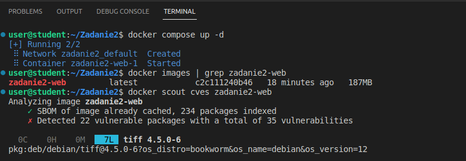
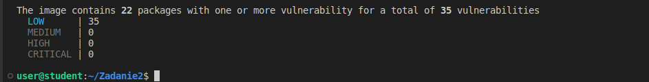
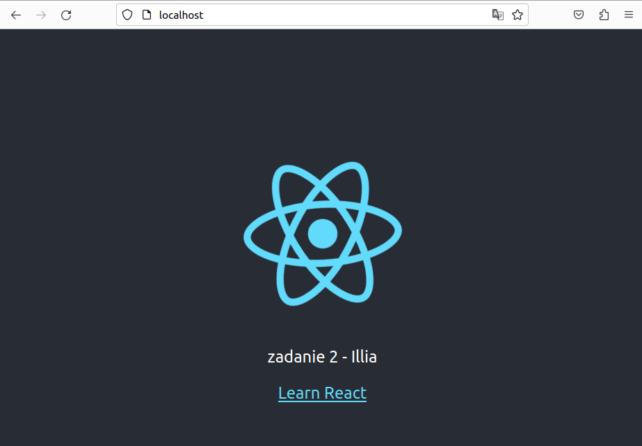

# Zadanie 2 - Część podstawowa

1. Budowanie kontenera i testowanie obrazu (docker scout)
```
docker compose up -d 
```
```
docker scout cves zadanie2-web
```



2. Aplikacja


3. Podstawowy workflow jest w pliku : [zadanie2_podstawowe.yml](.github/workflows/Z2podstawowe.yml)


# Część dodatkowa

Do oznaczania obrazów zastosowano pakiet "Semantic versioning", który umożliwia oznaczanie obrazów zgodnie z SemVer. Dzięki temu można przypisywać tagi do obrazów, a po kolejnym uruchomieniu workflow obraz zostaje oznaczony nowszą wersją.

1. Dodatkowy workflow jest w pliku : [zadanie2_dodatkowe.yml](.github/workflows/Z2dodatkowe.yml)
2. Wykonanie workflow znajduje się w zakładce Actions


